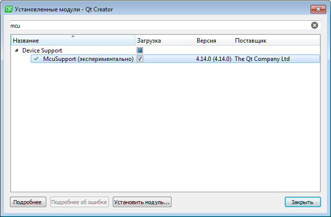

# Arduino-UNO-Blink-QtCreator-Project-Example
Arduino UNO Blink QtCreator Project Example

Для работы с Arduino в QtCreator необходимо его немного настроить.
Для этого необходимо:
* Добавить к (или создать) переменной среды Path путь к папке компилятора GCC-AVR. 
Обычно это «C:\Program Files (x86)\Arduino\hardware\tools\avr\bin»

* В QtCreator в меню «Справка->О модулях…» включить следующее.

* В QtCreator в меню «Инструменты->Параметры…» Добавить  комплект для AVR.
Там же можно настроить автоматическое форматирование кода.

* Для прошивки необходимо настроить запуск приложения avrdude.exe
с параметрами 
-c arduino -p m328p -P COMХХХ -b 115200 -U flash:w:%{CurrentBuild:QbsBuildRoot}%{ActiveProject:Name}.hex:i
Где COMХХХ порт вашей платы  Arduino
Если не работает то скопировать "avrdude.conf" из «C:\Program Files (x86)\Arduino\hardware\arduino\avr\bootloaders\gemma» в «C:/Program Files (x86)\Arduino\hardware\tools\avr\bin»
Перед прошивкой не забываем отключать терминал.

